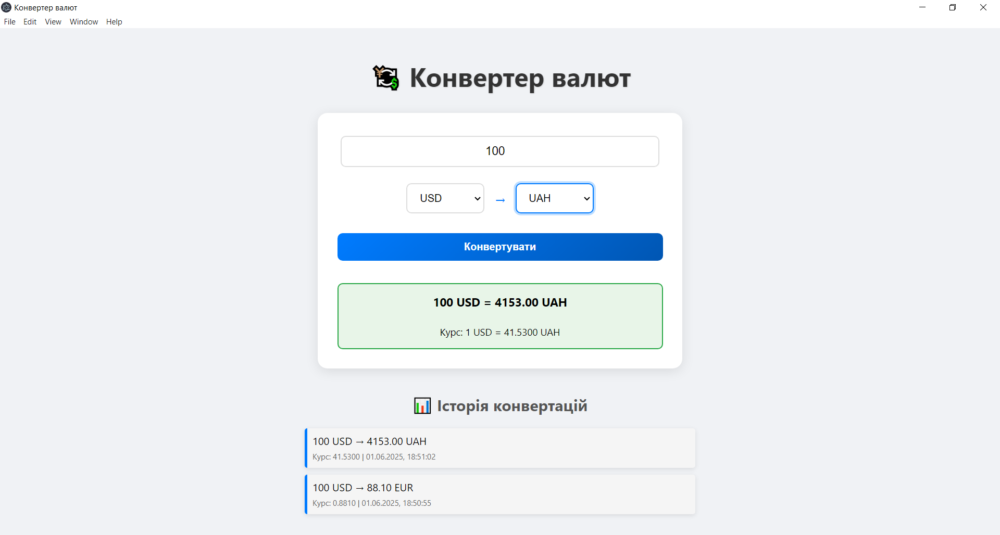

# 💱 Currency Converter
A modern, reliable currency converter desktop application built with Electron, featuring multiple API fallbacks and real-time exchange rates.

## ✨ Features
- **Real-time Exchange Rates**: Get up-to-date currency conversion rates
- **Conversion History**: Track your recent conversions with timestamps
- **Auto-conversion**: Automatically converts when you change currencies (if amount is entered)
- **Ukrainian Interface**: User-friendly interface in Ukrainian language

## 🛠 Stack
- Electron
- JavaScript (ES6+)
- HTML5/CSS3
- ExchangeRate.host API
- ExchangeRate-API (fallback)

## 🚀 Getting Started

### 1. Clone the repository
```bash
git clone https://github.com/yourusername/currency-converter.git
cd currency-converter
```

### 2. Install dependencies
```bash
npm install
```

### 3. Run the application
```bash
npm start
```

### Then the app will launch automatically! 🎉



### 🔗 Supported APIs
1. **Primary**: [ExchangeRate.host](https://exchangerate.host/) - Free tier with comprehensive currency support
2. **Fallback**: [ExchangeRate-API](https://exchangerate-api.com/) - Reliable backup with good uptime

